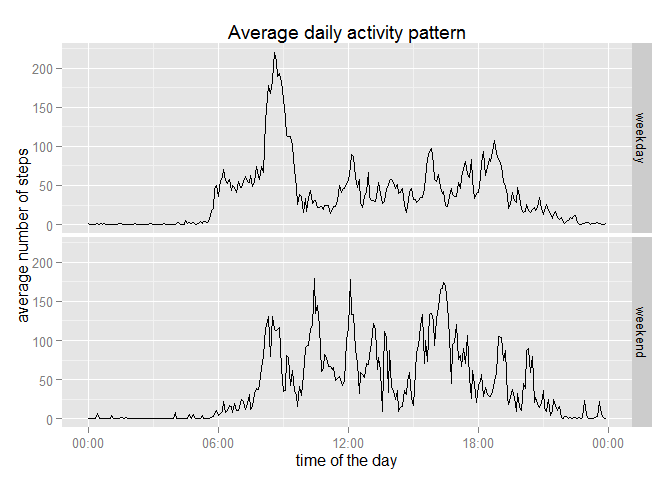

# Reproducible Research: Peer Assessment 1


## Loading and preprocessing the data
Unzip and read the input file:

```r
unzip("activity.zip")
activity <- read.csv("activity.csv")
```

Preparing the data for the analysis:

```r
activity$date <- as.Date(activity$date)
```

These are the used libraries:

```r
library(plyr)
library(lubridate)
```

```
## 
## Attaching package: 'lubridate'
## 
## The following object is masked from 'package:plyr':
## 
##     here
```

```r
library(ggplot2)
library(scales)
```

## What is mean total number of steps taken per day?

Histogram of the total number of steps taken per day:

```r
Steps.per.day<-ddply(activity,
                     .(date),
                     summarize,
                     steps.sum = sum(steps))

with(Steps.per.day,hist(steps.sum,
                        breaks = 20,
                        main = "Total number of steps",
                        xlab = "Number of steps"))
```

 

Mean and median of the total number of steps per day:

```r
mean(Steps.per.day$steps.sum, na.rm=TRUE)
```

```
## [1] 10766.19
```

```r
median(Steps.per.day$steps.sum, na.rm=TRUE)
```

```
## [1] 10765
```

## What is the average daily activity pattern?

Calculating the avarage of steps per interval:

```r
Steps.per.interval <- ddply(activity,
                            .(interval),
                            summarize,
                            steps.mean = mean(steps,na.rm=TRUE))
Steps.per.interval$time <- fast_strptime(sprintf("%04d", 
                                                 Steps.per.interval$interval), 
                                         "%H%M")
```

Plotting those averages and pointing out the interval with the maximum one:

```r
with(Steps.per.interval, {
     max.steps <- Steps.per.interval[steps.mean == max(steps.mean),]
     plot(time, steps.mean, 
          type="l", 
          main="Average daily activity pattern",
          ylab = "average number of steps",
          xlab = "time of the day")
     text(max.steps$time, 
          max.steps$steps.mean,
          label = paste("interval ", max.steps$interval),
          adj = c(-0.1,0.7),
          col = "red")
})
```

 

## Imputing missing values

Number of missing values (NAs) in the dataset:

```r
colSums(is.na(activity))
```

```
##    steps     date interval 
##     2304        0        0
```

Filling the NAs with the average of steps per interval:

```r
activity2<-ddply(activity,
                 .(interval),
                 mutate,
                 steps.mean = mean(steps,na.rm=TRUE))
activity2[is.na(activity2$steps),] <- mutate(activity2[is.na(activity2$steps),],
                                             steps = steps.mean)
```

In the histogram of the total number of steps taken per day after filling in the NAs we obtain an increase in the frequency, but the distribution remains similiar:

```r
Steps.per.day2<-ddply(activity2,
                 .(date),
                 summarize,
                 steps.sum = sum(steps,na.rm=TRUE))

with(Steps.per.day2,hist(steps.sum,
                         breaks = 20,
                         main = "Total number of steps",
                         xlab = "Number of steps"))
```

 
  
As expected, the new mean and median of the total number of steps per day in the filled dataset are similar to the ones we had before filling in:

```r
mean(Steps.per.day2$steps.sum, na.rm=TRUE)
```

```
## [1] 10766.19
```

```r
median(Steps.per.day2$steps.sum, na.rm=TRUE)
```

```
## [1] 10766.19
```

## Are there differences in activity patterns between weekdays and weekends?

Adding weekday or weekend to each row:

```r
activity2<-ddply(activity2,
                 .(date),
                 mutate,
                 weekend = weekdays(date) %in% c("Montag", "Sunday"))

activity2$weekend[activity2$weekend] <- "weekend"
activity2$weekend[!activity2$weekend == "weekend"] <- "weekday"
activity2$weekend <- as.factor(activity2$weekend)
```

Comparing the average daily activity pattern between weekdays and weekends:


```r
Steps.per.interval2 <- ddply(activity2,
                             .(interval,weekend),
                             summarize,
                             steps.mean = mean(steps, na.rm=TRUE))
Steps.per.interval2$time <- fast_strptime(sprintf("%04d", 
                                                  Steps.per.interval2$interval), 
                                          "%H%M")

p<-qplot(time, steps.mean,
         data = Steps.per.interval2,
         facets = weekend~.,
         geom = c("line"),
         main = "Average daily activity pattern")  + 
  xlab("time of the day") +
  ylab("average number of steps") +
  scale_x_datetime(labels = date_format("%H:%M"))
print(p)
```

 


